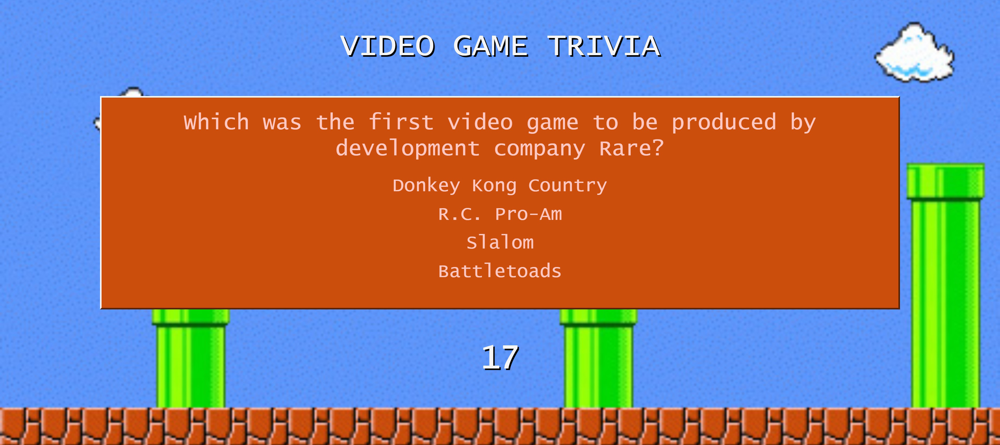

## Trivia Game

### Overview

Open Trivia Database was used to generate questions. 
[API Documentation:](https://opentdb.com/api_config.php)

## How to Play

Upon visiting the site, a "session token" is generated from open trivia database.  This tracks which questions have already been asked so the player doesn't get repeat questions.  The session token will reset if the player happens to complete all the questions in the category.  The player has a limited amount of time to answer a given trivia question correctly.  After 10 questions, the player's results will be displayed and they can choose to play again. 
